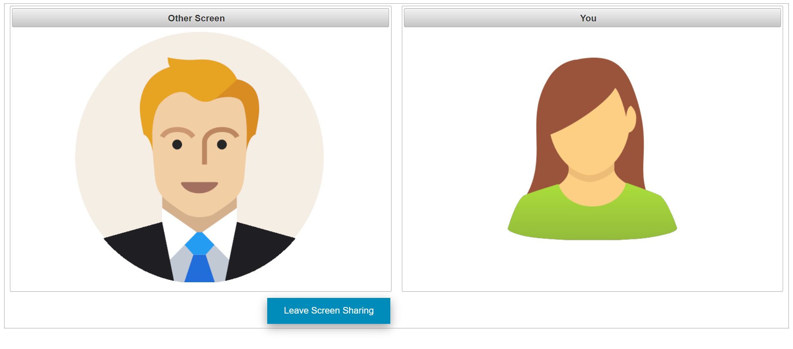
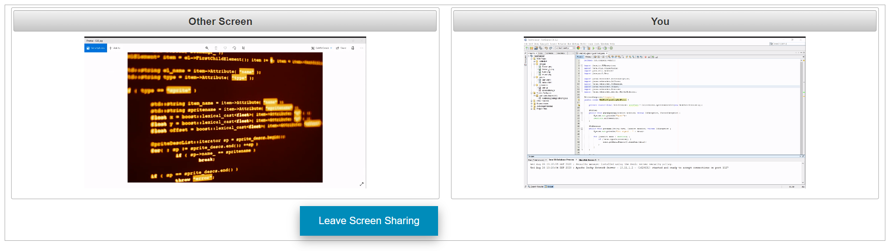
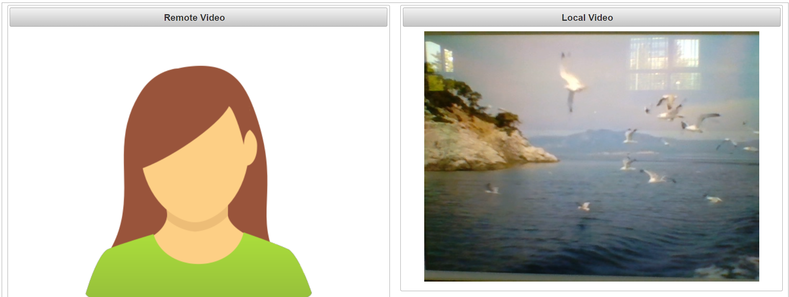
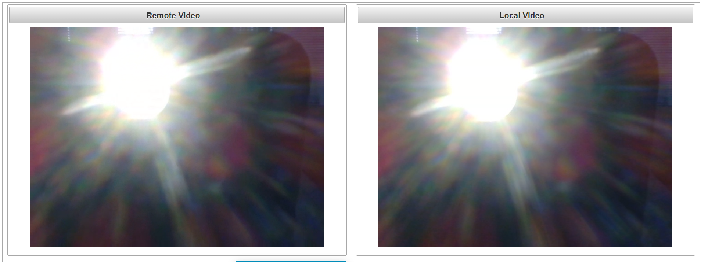

# Teamviewer - WebRTC Demo

This is a demo project using WebRTC, an open project that enables web browsers with Real-Time Communications (RTC) capabilities via simple JavaScript APIs.

## Features 

### Index 
* Simple 2 person screen sharing web application. 
* Both of them can share their desktops or Chrome Tabs and can see each other's screen.
* They also can leave screen sharing using a provided button.

### Cam
* Simple 2 person video cam web application. 
* Both of them can see and hear each other via video cam.
* They also can leave screen sharing using a provided button.
 

## Resources

* Andrii Sergiienko - WebRtc CookBook
